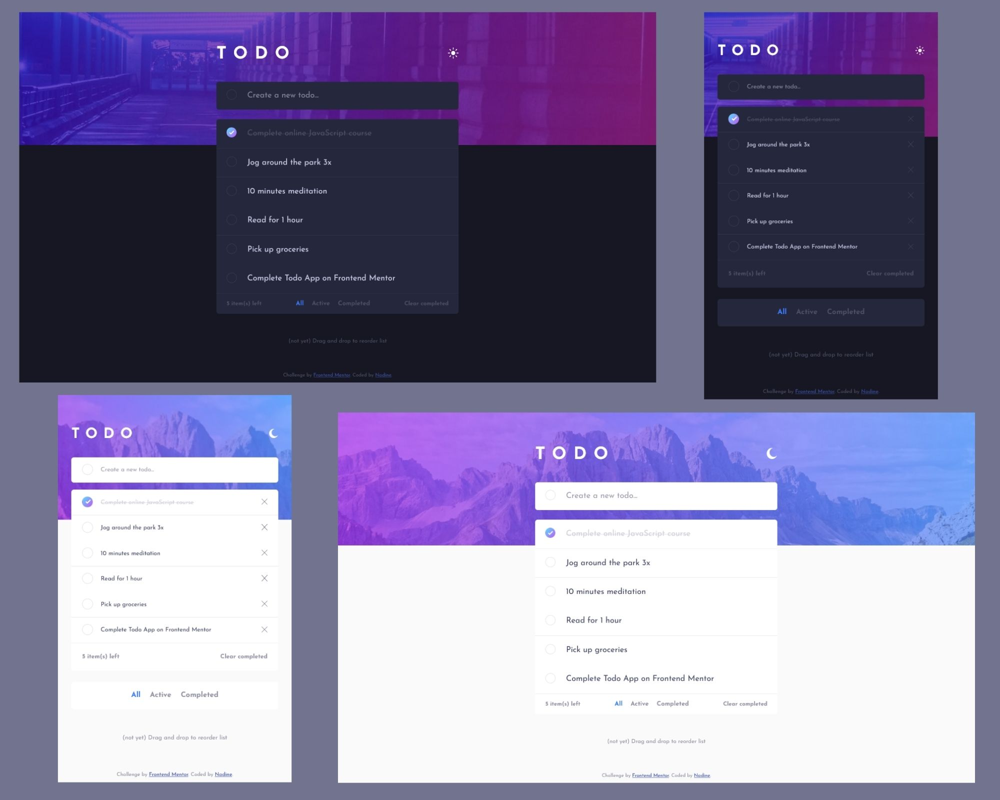

In addition to solve the challenge proposed by Frontend Mentor, my goal was to apply professionnal methods, such as feature-based architecture, testing and pull requests.

# Frontend Mentor - Todo app solution

This is a solution to the [Todo app challenge on Frontend Mentor](https://www.frontendmentor.io/challenges/todo-app-Su1_KokOW). Frontend Mentor challenges help you improve your coding skills by building realistic projects.

## Table of contents

- [Overview](#overview)
  - [The challenge](#the-challenge)
  - [Screenshot](#screenshot)
  - [Links](#links)
- [My process](#my-process)
  - [Built with](#built-with)
  - [What I learned](#what-i-learned)
  - [Continued development](#continued-development)
  - [Useful resources](#useful-resources)
- [Author](#author)

## Overview

### The challenge

Users should be able to:

- View the optimal layout for the app depending on their device's screen size
- See hover states for all interactive elements on the page
- Add new todos to the list
- Mark todos as complete
- Delete todos from the list
- Filter by all/active/complete todos
- Clear all completed todos
- Toggle light and dark mode
- **Bonus**: Drag and drop to reorder items on the list

### Screenshot

### Links

- Solution URL: [https://github.com/nadlgit/fmchallenge-todo-app](https://github.com/nadlgit/fmchallenge-todo-app)
- Live Site URL: [https://nadlgit.github.io/fmchallenge-todo-app](https://nadlgit.github.io/fmchallenge-todo-app)

## My process

### Built with

- [React](https://reactjs.org/), bootstrapped with [Create React App](https://github.com/facebook/create-react-app)
- Responsive
- CSS Grid
- Flexbox
- CSS custom properties
- [CSS modules](https://github.com/css-modules/css-modules)

### What I learned

I learnt a lot in CSS, especially for the custom checkboxes. I also spent some time to figure out an elegant way to deal with the bottom of the UI (the part with the filters) which is very different between desktop and mobile designs. And I found CSS modules quite handy.

Moreover, with this project I defined a structure for my React projects, including testing.

### Continued development

There is still a lot to do with this project:

- Persist todos in localStorage or in a backend like Firebase, with a loading UI while retrieving data.
- Implement drag and drop as suggested as bonus.

For this project and next ones, I want to improve my React skills.

### Useful resources

- (french) [Personnaliser les boutons radio et checkbox avec CSS](https://juliencrego.com/astuces/personnaliser-les-boutons-radio-et-checkbox-avec-css/) - This article explains with many examples how to have custom styled checkboxes and radio buttons.
- [How Should I Style My React Application?](https://leerob.io/blog/css-with-react) - This article reflects my struggling with CSS in React and gives pros and cons of each option.
- [Evolution of a React folder structure and why to group by features right away](https://profy.dev/article/react-folder-structure) - This article guided me to define my folder structure. It also taught me about some best practices such as absolute imports and why to use kebab-case naming for files and folders.

## Author

- Frontend Mentor - [@nadlgit](https://www.frontendmentor.io/profile/nadlgit)
